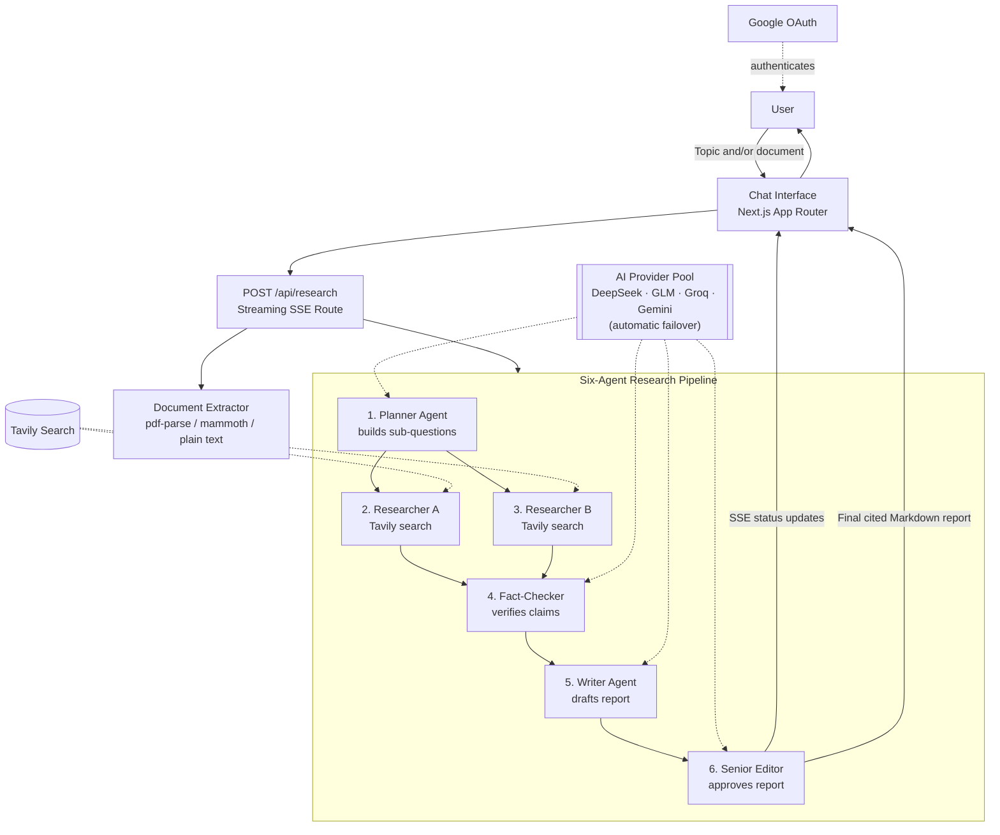
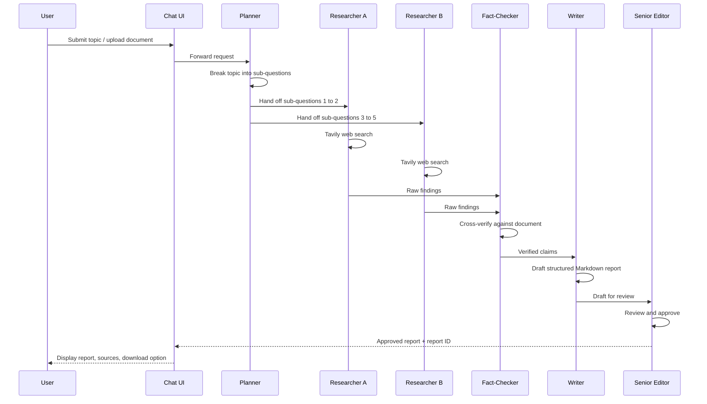
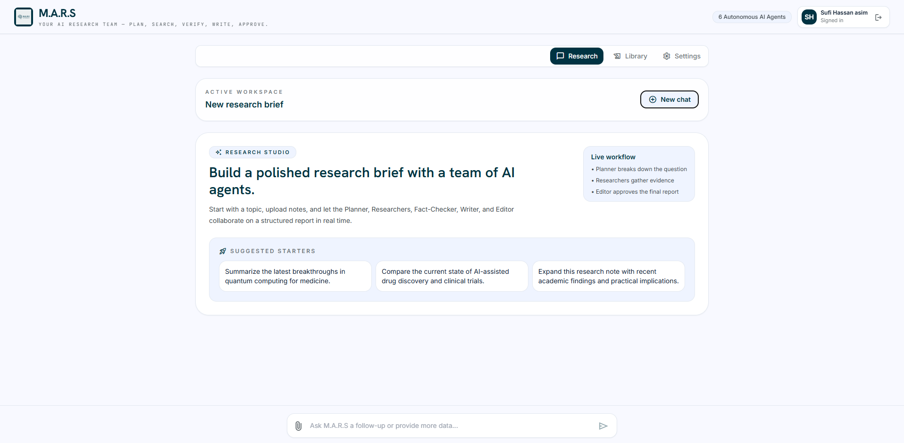
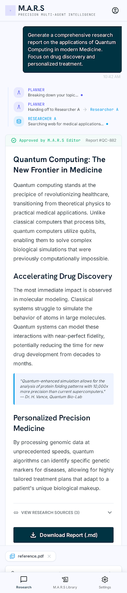
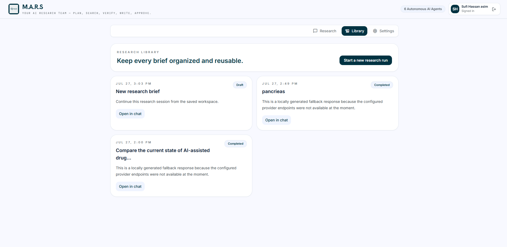
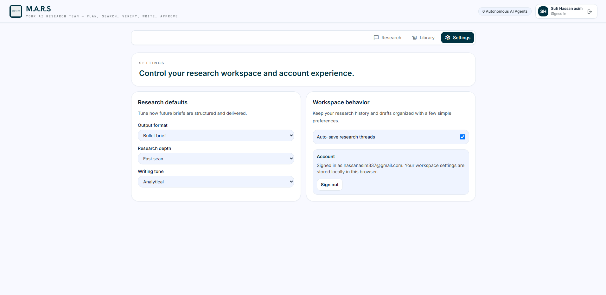
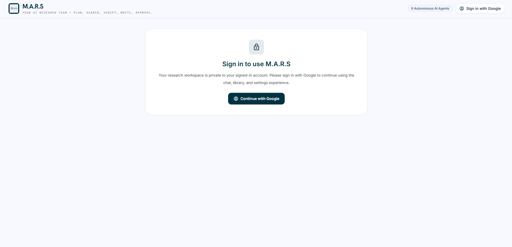
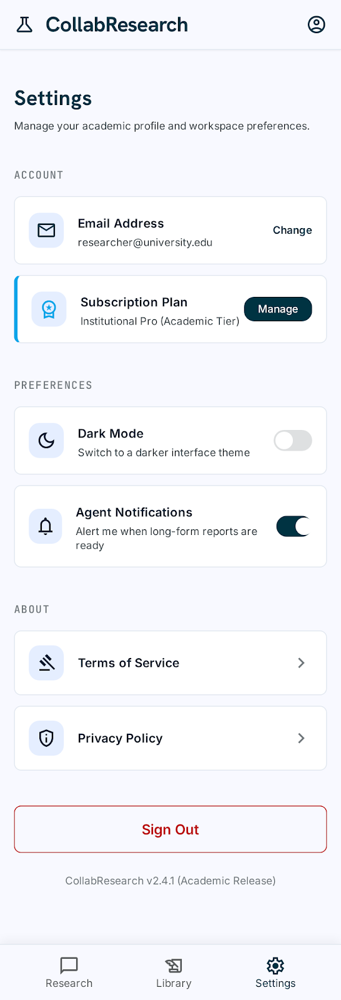

<div align="center">

# M.A.R.S — Multi-Agent Research System

**Your AI research team — plan, search, verify, write, approve.**

[](https://m-a-r-s.vercel.app/)
[](https://nextjs.org/)
[](https://mastra.ai/)
[](#tech-stack)
[](#license)

</div>

---

## Table of Contents

- [Overview](#overview)
- [Live Deployment](#live-deployment)
- [Problem Statement](#problem-statement)
- [Feature List](#feature-list)
- [The AI Feature](#the-ai-feature)
- [Architecture](#architecture)
- [Tech Stack](#tech-stack)
- [Screenshots](#screenshots)
- [Getting Started](#getting-started)
- [Environment Variables](#environment-variables)
- [Security Notes](#security-notes)
- [Deployment](#deployment)
- [Project Structure](#project-structure)
- [License](#license)
- [Author](#author)

---

## Overview

**M.A.R.S** (Multi-Agent Research System) is a chat-based research report generator built on **Next.js**, orchestrated with **Mastra**, powered by a **pool of AI model providers**, and grounded in live web data through **Tavily Search**.

A user enters a research topic, optionally attaches a source document (`.pdf`, `.docx`, `.md`, `.txt`), and a team of six specialized AI agents collaborates in real time to plan, research, fact-check, draft, and approve a fully cited Markdown research report.

| | |
|---|---|
| **Status** | Live in production |
| **Deployment** | Single unified Vercel project (frontend + Edge API) |
| **Authentication** | Google OAuth |
| **Model strategy** | Multi-provider pool with automatic failover |

---

## Live Deployment

<div align="center">

[](https://m-a-r-s.vercel.app/)

**[https://m-a-r-s.vercel.app/](https://m-a-r-s.vercel.app/)**

</div>

Sign-in is handled through Google OAuth. Once authenticated, the workspace (research threads, drafts, and settings) is scoped privately to the signed-in account.

---

## Problem Statement

Producing a well-researched, well-cited report is slow when done manually: a person has to formulate sub-questions, search multiple sources, cross-check claims, write a coherent draft, and edit it for consistency — often across several sittings.

**M.A.R.S solves this for:**

- **Students and researchers** who need a structured, source-backed first draft on a topic quickly.
- **Professionals and analysts** who want to expand an existing note or draft with fresh, verified web research instead of starting from a blank page.
- **Anyone evaluating a topic** who wants a transparent, step-by-step view of how an AI system reasons about a question — rather than a single opaque answer.

Instead of one model generating an answer in a single pass, M.A.R.S splits the job across specialized agents that each do one part of the work well, and shows that pipeline happening live.

---

## Feature List

- **Six autonomous AI agents** collaborating in a fixed pipeline: Planner, Researcher A, Researcher B, Fact-Checker, Writer, Senior Editor.
- **Live handoff streaming** — the chat UI shows real-time status updates (via Server-Sent Events) as each agent starts, works, and hands off to the next.
- **Document-grounded expansion** — upload a `.pdf`, `.docx`, `.md`, or `.txt` file and M.A.R.S expands on it with new, cited web research rather than ignoring it.
- **Live web research** on every run through the Tavily search API, so reports reflect current information rather than only model training data.
- **Fact-checking pass** that cross-verifies claims gathered by the research agents against the user's own source document before drafting begins.
- **Editorial approval step** — a Senior Editor agent reviews and approves the final draft before it is presented, shown in-app as an "Approved by M.A.R.S Editor" badge with a report ID.
- **Downloadable reports** in Markdown format, with an expandable "View Research Sources" panel listing the citations used.
- **Research Library** — every past research run is saved with its status (Draft / Completed) and can be reopened in chat.
- **Workspace settings** — configurable output format (e.g. bullet brief), research depth (e.g. fast scan), and writing tone (e.g. analytical), plus auto-save of research threads.
- **Multi-provider model pool with failover** — requests are distributed across several AI providers (DeepSeek, GLM, Groq, Gemini) so the pipeline keeps running even if one provider is rate-limited or unavailable.
- **Google OAuth authentication** — each user's research workspace is private to their signed-in Google account.
- **Responsive design** — a single codebase serving both the mobile chat experience and the full desktop workspace (Research, Library, Settings).

---

## The AI Feature

The core AI feature is the **six-agent research pipeline**. Each agent has a narrow, well-defined responsibility, and the output of one agent becomes the input of the next — the same way a small human research team would divide the work.

| Step | Agent | Responsibility |
|---|---|---|
| 1 | **Planner** | Reads the topic and any attached document, then breaks the request down into four to five focused sub-questions that will guide the research. |
| 2 | **Researcher A** | Performs live Tavily web searches to answer the first half of the sub-questions. |
| 3 | **Researcher B** | Works in parallel to research the remaining sub-questions, so both researchers contribute independent, non-overlapping findings. |
| 4 | **Fact-Checker** | Cross-verifies the claims gathered by both researchers against each other and against the user's uploaded document, flagging anything unsupported. |
| 5 | **Writer** | Synthesizes the verified research into a structured, cited Markdown report. |
| 6 | **Senior Editor** | Reviews the draft for accuracy, structure, and tone, and issues the final approval shown to the user. |

**Operating principles the pipeline enforces at each stage:**

- Sub-questions must be specific enough to map directly to a web search, not generic restatements of the topic.
- Claims introduced by a researcher must be checked against at least one other source or the user's document before being passed to the Writer.
- The Writer is only allowed to use fact-checked material — anything the Fact-Checker could not verify is excluded rather than guessed at.
- The Senior Editor is the final gate: a report is only marked "Approved" once it has passed this review, which is why every completed report displays an approval badge and report ID in the interface.

**Models and services behind the pipeline:**

- Language generation is routed across a **pool of AI providers** — DeepSeek (dual key rotation), GLM (Zhipu AI), Groq, and Gemini — so the pipeline can fail over to another provider if one is rate-limited or unavailable.
- Live web search is provided by **Tavily**.
- Authentication is handled through **Google OAuth**, scoping each research workspace to a signed-in account.

---

## Architecture

### System flow



### Agent handoff sequence



---

## Tech Stack

| Layer | Technology |
|---|---|
| Framework | Next.js (App Router) |
| Agent orchestration | Mastra |
| Language models | Multi-provider pool — DeepSeek (2 keys), GLM (Zhipu AI), Groq, Gemini — with automatic failover |
| Web search | Tavily API |
| Document parsing | `pdf-parse`, `mammoth`, and native text handling for `.md` / `.txt` |
| Streaming | Server-Sent Events (SSE) over a single Next.js API route |
| Authentication | Google OAuth (Google Cloud client credentials) |
| Hosting | Vercel (unified frontend + Edge API deployment) |

---

## Screenshots

<table>
<tr>
<td width="50%">

**Research Studio — Home**



The desktop landing workspace: suggested starters, the live workflow summary, and the entry point for a new research brief.

</td>
<td width="50%">

**Live Agent Pipeline & Report**



The Planner and Researcher agents streaming live status updates, followed by the final approved, cited report with a download option.

</td>
</tr>
<tr>
<td width="50%">

**Research Library**



Every past research run saved with its status — Draft or Completed — and reopenable directly in chat.

</td>
<td width="50%">

**Workspace Settings**



Configurable output format, research depth, and writing tone, alongside auto-save and account controls.

</td>
</tr>
<tr>
<td width="50%">

**Authentication Gate**



Research workspaces are private per account; unauthenticated visitors are prompted to continue with Google.

</td>
<td width="50%">

**Early Interface Concept**



An earlier design iteration from the project's working prototype (internal codename "CollabResearch"), kept here for reference alongside the current M.A.R.S interface.

</td>
</tr>
</table>

> **Note:** A Google account-chooser screenshot captured during testing was intentionally excluded from this README, since it displayed personal email addresses tied to the developer's accounts.

---

## Getting Started

### Prerequisites

- Node.js 18 or later
- npm
- API keys for DeepSeek, GLM, Groq, Gemini, and Tavily
- A Google Cloud OAuth client (ID, secret, redirect URI)

### Installation

```bash
git clone https://github.com/Hassan-asim/mars-research.git
cd mars-research
npm install
```

### Configure environment

Create a `.env.local` file in the project root (see [Environment Variables](#environment-variables) below), then start the development server:

```bash
npm run dev
```

Open [http://localhost:3000](http://localhost:3000) in a browser.

### Production build check

```bash
npm run build
```

---

## Environment Variables

Create `.env.local` in the project root with the following keys. **Never commit this file** — it is already covered by `.gitignore`, and the values below are placeholders only.

```env
# AI Model Providers (multi-provider pool with failover)
DEEPSEEK_API_KEY_1=
DEEPSEEK_API_KEY_2=
GLM_API_KEY=
GROQ_API_KEY=
GEMINI_API_KEY=

# Google OAuth (authentication)
GOOGLE_CLIENT_ID=
GOOGLE_CLIENT_SECRET=
GOOGLE_REDIRECT_URI=https://m-a-r-s.vercel.app/auth/google/callback

# Web Search
TAVILY_API_KEY=
```

| Variable | Purpose |
|---|---|
| `DEEPSEEK_API_KEY_1` / `DEEPSEEK_API_KEY_2` | Dual-key rotation for DeepSeek model calls |
| `GLM_API_KEY` | Zhipu AI GLM model access |
| `GROQ_API_KEY` | Groq inference access |
| `GEMINI_API_KEY` | Google Gemini model access |
| `GOOGLE_CLIENT_ID` / `GOOGLE_CLIENT_SECRET` | Google OAuth application credentials |
| `GOOGLE_REDIRECT_URI` | OAuth callback URL registered in Google Cloud Console |
| `TAVILY_API_KEY` | Powers live web search for the Researcher agents |

Add the same variables in **Vercel → Project Settings → Environment Variables** for production.

---

## Security Notes

- `.env.local` and any `client_secret_*.json` files must stay out of version control. Confirm both are listed in `.gitignore` before pushing.
- Treat every key above as sensitive, including provider keys with generous free tiers — rotate any credential that may have been exposed (e.g. shared in chat, screenshots, or logs).
- The Google OAuth redirect URI must match exactly what is registered in the Google Cloud Console for the production domain.

---

## Deployment

M.A.R.S is deployed as a single Vercel project containing both the frontend and the Edge API backend.

1. Push the repository to GitHub.
2. Import the repository at [vercel.com/new](https://vercel.com/new).
3. Add all environment variables listed above in the Vercel project settings.
4. Deploy. Vercel builds and serves the app on one serverless URL: **[m-a-r-s.vercel.app](https://m-a-r-s.vercel.app/)**.

---

## Project Structure

```
Act ai final/
├── app/                                    # Next.js App Router pages and API routes
├── components/                             # Shared UI components
├── lib/                                    # Provider pool, Tavily client, document extraction utilities
├── public/                                 # Static assets
├── screenshots/                            # Images used in this README
├── stitch_file_driven_frontend_builder/    # Stitch-generated frontend build assets
├── extracted_stitch/                       # Extracted Stitch design output
├── scratch/                                # Working / scratch files
├── .env.local                              # Local environment variables (not committed)
├── .gitignore
├── package.json
├── package-lock.json
├── postcss.config.js
├── tailwind.config.js
├── tsconfig.json
├── next-env.d.ts
├── PRD-v3-chat-fileupload.md               # Product requirements document
├── stitch-chat-ui-prompt.md                # Stitch UI generation prompt
├── coding-agent-prompt-v2.json             # Coding agent prompt reference
└── README.md
```

> Build output (`.next/`), dependencies (`node_modules/`), and editor/IDE folders (`.vscode/`, `.ideavo/`) are omitted above as they are not part of the tracked source tree.

---

## License

Released under the **MIT License**. Built for precision multi-agent research.

---

## Author

<div align="center">

**Sufi Hassan Asim**
AI Engineer · Founder, Devise Solutions

[](https://github.com/Hassan-asim)
[](https://linkedin.com/in/sufi-hassan-asim)

</div>
